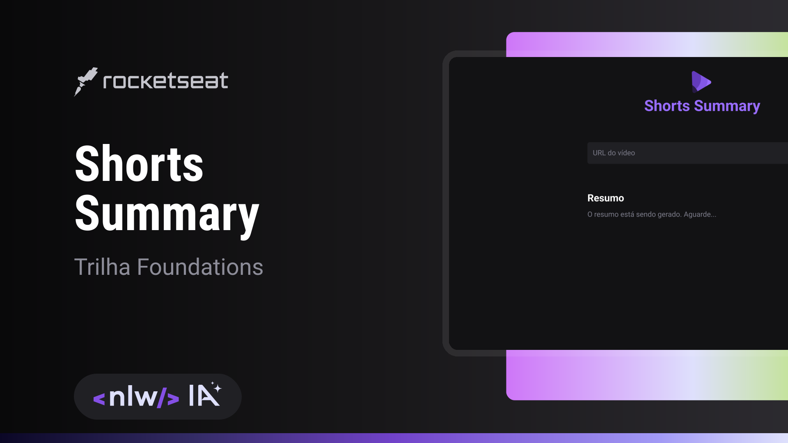

# Shorts Summary

O Shorts Summary é uma aplicação web inovadora que simplifica o processo de resumir vídeos. Com uma interface limpa e fácil de usar, esta ferramenta permite que você insira a URL de um vídeo e obtenha um resumo rapidamente. Não importa se você está assistindo a um tutorial extenso, uma palestra importante ou um vídeo de entretenimento, o Shorts Summary é a sua solução para economizar tempo.

**Recursos Principais:**
- **Simplicidade:** Com apenas alguns cliques, você pode resumir qualquer vídeo online.
- **Eficiência:** O resumo é gerado em questão de segundos, poupando seu tempo precioso.
- **Compatibilidade:** Funciona com uma ampla variedade de vídeos de diferentes fontes na web.
- **Personalização:** Ajuste o resumo de acordo com suas preferências.
- **Visual Atraente:** Apresentado em um design moderno, simples e atraente.

  

## 🤝 Colaboradores

Agradecemos às seguintes pessoas que contribuíram para este projeto:

<table>
  <tr>
    <td align="center">
      <a href="https://github.com/GabrielBorges2000">
         
        
          <b>Gabriel Borges</b>
        
      </a>
    </td>
  </tr>
</table>

## 😄 Obrigado pela Atenção! 

Gostou desse projeto? Deixe um Like!
